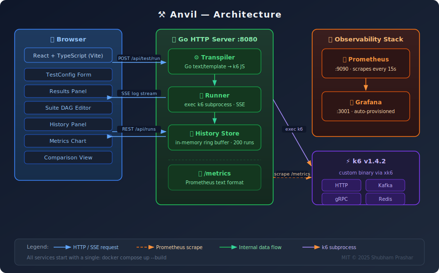
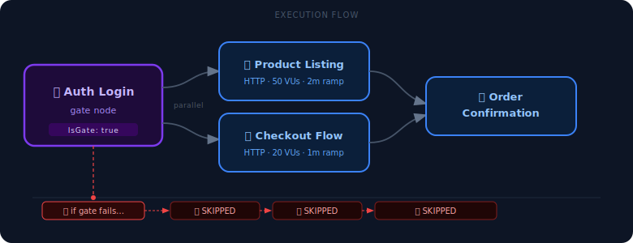

<div align="center">


# ⚒️ Anvil

**A developer-first, open-source load testing framework powered by [k6](https://k6.io)**

[](https://go.dev)
[](https://react.dev)
[](https://www.typescriptlang.org)
[](https://k6.io)
[](https://docs.docker.com/compose/)
[](https://prometheus.io)
[](https://grafana.com)
[](LICENSE)

[**Live Demo**](#quick-start) · [**Architecture**](#architecture) · [**API Reference**](#api-reference) · [**Contributing**](#contributing)

---

> Anvil wraps the power of k6 in a beautiful web UI. Design multi-protocol load tests, watch them run in real time, compare results across runs, and monitor Anvil itself with a pre-wired Prometheus + Grafana stack — all in a single `docker compose up`.

</div>

---

## ✨ Features

| | Feature | Details |
|---|---|---|
| 🌐 | **Multi-protocol** | HTTP, gRPC, Apache Kafka, Redis |
| 🎛️ | **Visual test builder** | Drag-and-drop stage editor, threshold manager, custom headers |
| 🔗 | **Suite DAG editor** | Wire tests into dependency graphs with gate nodes and parallelism |
| 📡 | **Live log streaming** | SSE-based real-time k6 output in the browser |
| 📊 | **Metrics dashboard** | Recharts latency percentiles (p50/p95/p99/avg), req/s, error rate, VU count |
| 🕓 | **Run history** | In-memory ring buffer of last 200 runs with full config + metrics replay |
| ⚖️ | **Run comparison** | Side-by-side δ% diff of any two historical runs |
| 🖥️ | **k6 web dashboard** | Embedded live metrics iframe (port `5665`) |
| 📄 | **HTML report export** | Standalone k6 web dashboard snapshot per run |
| 📈 | **Self-monitoring** | Prometheus `/metrics` endpoint + pre-built Grafana dashboard for Anvil itself |
| 🤖 | **AI run summaries** | LLM-powered plain-English analysis of every run (OpenAI / Anthropic / Ollama) |
| 🐳 | **One-command deploy** | Single `docker compose up --build` starts everything |

---

## 🚀 Quick Start

### Prerequisites

- [Docker Desktop](https://www.docker.com/products/docker-desktop/) ≥ 24 (or Docker Engine + Compose v2)
- 4 GB free RAM (k6 + Grafana are hungry)

### Run it

```bash
git clone https://github.com/shubhamprashar/anvil.git
cd anvil
docker compose up --build
```

That's it. Four services start:

| Service | URL | Description |
|---|---|---|
| **Anvil UI** | http://localhost:3000 | React frontend |
| **Anvil API** | http://localhost:8080 | Go REST + SSE backend |
| **Prometheus** | http://localhost:9090 | Metrics scraper |
| **Grafana** | http://localhost:3001 | Pre-built Anvil dashboard (`admin` / `admin`) |

> The k6 live dashboard is accessible at **http://localhost:5665** while a test is running.

---

## 🏗️ Architecture



### Directory Layout

```
anvil/
├── backend/                   # Go service
│   ├── cmd/server/main.go     # Entrypoint — wires DI, starts HTTP server
│   ├── internal/
│   │   ├── api/
│   │   │   ├── server.go      # HTTP mux, Prometheus middleware, /metrics route
│   │   │   ├── handlers.go    # REST handlers (run, stream, report, history)
│   │   │   ├── suite_handlers.go  # Suite DAG execution handlers
│   │   │   └── llm_handlers.go    # LLM status + summarize endpoints
│   │   ├── metrics/
│   │   │   └── metrics.go     # Prometheus metric definitions (Gauges, Counters, Histograms)
│   │   ├── models/
│   │   │   └── models.go      # Shared types: TestConfig, Run, Suite, HistoryRecord, …
│   │   ├── llm/
│   │   │   └── llm.go         # Provider-agnostic LLM interface (OpenAI / Anthropic / Ollama / mock)
│   │   ├── runner/
│   │   │   ├── runner.go      # k6 subprocess manager, SSE broadcaster, history ring buffer
│   │   │   └── suite_runner.go  # DAG topological sort + parallel node execution
│   │   └── transpiler/
│   │       └── transpiler.go  # Go text/template → k6 JS (HTTP / gRPC / Kafka / Redis)
│   ├── Dockerfile             # Multi-stage: Go builder + xk6 builder + minimal alpine
│   └── go.mod
│
├── frontend/                  # React + TypeScript SPA
│   ├── src/
│   │   ├── App.tsx            # Root: mode switcher (Test / Suite / History)
│   │   ├── components/
│   │   │   ├── TestConfigForm.tsx    # Main test builder form
│   │   │   ├── StageBuilder.tsx      # VU ramp-up stage editor
│   │   │   ├── ThresholdEditor.tsx   # Pass/fail threshold rules
│   │   │   ├── HeaderEditor.tsx      # Custom HTTP headers
│   │   │   ├── ResultsPanel.tsx      # Live log + metrics tabs
│   │   │   ├── MetricsChart.tsx      # Recharts latency bar chart + stat cards
│   │   │   ├── SuiteEditor.tsx       # ReactFlow DAG canvas
│   │   │   ├── SuiteResultsPanel.tsx # Node-level suite run status
│   │   │   ├── HistoryPanel.tsx      # Run list + detail view
│   │   │   └── ComparisonView.tsx    # Side-by-side run diff
│   │   ├── api/
│   │   │   ├── testRunner.ts   # fetch wrappers for /api/test/*
│   │   │   ├── suiteRunner.ts  # fetch wrappers for /api/suite/*
│   │   │   └── history.ts      # fetch wrappers for /api/runs
│   │   └── types/index.ts      # TypeScript mirror of Go models
│   └── Dockerfile
│
├── prometheus/
│   └── prometheus.yml         # Scrape config: backend:8080/metrics every 15s
│
├── grafana/
│   ├── provisioning/
│   │   ├── datasources/prometheus.yml   # Auto-provisions Prometheus datasource
│   │   └── dashboards/provider.yml      # Dashboard directory provider
│   └── dashboards/
│       └── anvil.json         # 8-panel pre-built Anvil dashboard
│
└── docker-compose.yml         # Orchestrates all 4 services
```

---

## 🔌 Supported Protocols

### HTTP

Point Anvil at any REST endpoint. Configure method, path, headers, and request body. Thresholds let you define SLA rules — Anvil will mark the run as failed if they are breached.

```
Protocol:  HTTP
Method:    POST
URL:       https://api.example.com/users
Body:      { "name": "load-test-user" }
Stages:    0→10 VUs over 30s → hold 10 VUs for 1m → ramp down 30s
Threshold: http_req_duration p(95) < 500ms
```

### gRPC

Upload your `.proto` file directly in the UI. Anvil writes it beside the k6 script so `client.load()` finds it at runtime.

```
Protocol: gRPC
Host:     grpc.example.com:443
Service:  helloworld.Greeter
Method:   SayHello
Payload:  { "name": "anvil" }
TLS:      true
```

### Apache Kafka

Runs the custom k6 binary (built with [xk6-kafka v1.2.0](https://github.com/mostafa/xk6-kafka)) to produce messages at configurable throughput.

```
Protocol: Kafka
Brokers:  ["localhost:9092"]
Topic:    load-test-events
Message:  { "event": "page_view", "user": "anvil-load-test" }
```

### Redis

Uses the built-in `k6/experimental/redis` module. Supports SET, GET, INCR, LPUSH, and more.

```
Protocol: Redis
Address:  localhost:6379
Command:  SET
Key:      anvil:counter
Value:    hello-world
```

---

## 🧪 Test Suites (DAG Mode)

The **Suite** tab lets you compose multiple tests into a dependency graph.



> Gate nodes (`IsGate: true`) stop all downstream nodes if they fail — protecting you from running checkout tests when auth is broken.

- Nodes run **in parallel** whenever their dependencies are satisfied
- **Gate nodes** (`IsGate: true`) stop all downstream nodes if they fail
- Real-time node status is streamed over SSE — the canvas updates live
- Each node result links to its individual k6 run report

---

## 📊 Observability

Anvil instruments itself using **Prometheus** and ships with a pre-built **Grafana** dashboard.

### Exposed Metrics (`GET /metrics`)

| Metric | Type | Description |
|---|---|---|
| `anvil_active_runs` | Gauge | k6 tests currently executing |
| `anvil_runs_total{status}` | Counter | Completed runs, partitioned by `completed` / `failed` |
| `anvil_http_request_duration_seconds{method,path,status}` | Histogram | API request latency (DefBuckets) |
| `anvil_http_requests_total{method,path,status}` | Counter | Total API requests |

> Path labels are normalised — nanosecond run IDs are replaced with `{id}` to prevent high cardinality.

### Grafana Dashboard

Log into Grafana at **http://localhost:3001** (credentials: `admin` / `admin`). The **Anvil — Load Testing Framework** dashboard is pre-provisioned with 8 panels:

- Active Runs (stat)
- Runs Completed (stat)
- Runs Failed (stat)
- Goroutines (stat + time series)
- Heap Memory (time series)
- API Request Rate (time series)
- API p95 Latency (time series)

---

## 🌐 API Reference

All endpoints are served by the Go backend on port `8080`.

### Test Runs

| Method | Path | Description |
|---|---|---|
| `POST` | `/api/test/run` | Start a new k6 run. Body: `TestConfig` JSON. Returns `{ runId }`. |
| `GET` | `/api/test/{id}/stream` | SSE stream of k6 log lines. Closes with `event: done`. |
| `GET` | `/api/test/{id}/report` | JSON metrics for a completed run. |
| `GET` | `/api/test/{id}/html-report` | Standalone k6 HTML dashboard export. |
| `DELETE` | `/api/test/{id}` | Abort a running test. |

### History

| Method | Path | Description |
|---|---|---|
| `GET` | `/api/runs` | List last 100 completed runs (newest first). |
| `GET` | `/api/runs/{id}` | Single historical run record with full config + metrics. |

### Suites

| Method | Path | Description |
|---|---|---|
| `POST` | `/api/suite/run` | Execute a suite DAG. Body: `Suite` JSON. Returns `{ suiteRunId }`. |
| `GET` | `/api/suite/{id}/status` | JSON snapshot of suite run (node statuses + overall status). |
| `GET` | `/api/suite/{id}/stream` | SSE stream of suite node state changes. |

### LLM Summaries

| Method | Path | Description |
|---|---|---|
| `GET` | `/api/llm/status` | `{ enabled, provider, model }` — whether LLM is configured. |
| `POST` | `/api/llm/summarize/{id}` | Returns `{ summary }` — plain-English AI analysis of the run. `501` if LLM is disabled. |

### Health & Monitoring

| Method | Path | Description |
|---|---|---|
| `GET` | `/health` | `{ "status": "ok" }` |
| `GET` | `/metrics` | Prometheus text exposition format |

### `TestConfig` Schema

```jsonc
{
  "name": "My Load Test",
  "protocol": "http",           // "http" | "grpc" | "kafka" | "redis"
  "baseUrl": "https://api.example.com",
  "method": "POST",             // HTTP only
  "path": "/users",
  "headers": [{ "key": "Authorization", "value": "Bearer ..." }],
  "body": "{\"name\":\"test\"}",
  "stages": [
    { "duration": "30s", "target": 10 },
    { "duration": "1m",  "target": 10 },
    { "duration": "30s", "target": 0  }
  ],
  "thresholds": [
    { "metric": "http_req_duration", "condition": "p(95)<500" }
  ],
  // Protocol-specific (only one of these):
  "grpcConfig":  { "host": "...", "protoContent": "...", "service": "...", "method": "...", "payload": "{}", "tls": true },
  "kafkaConfig": { "brokers": ["localhost:9092"], "topic": "events", "message": "hello" },
  "redisConfig": { "addr": "localhost:6379", "command": "SET", "key": "k", "value": "v" }
}
```

---

## 🛠️ Local Development (without Docker)

### Backend

```bash
cd backend

# Install dependencies
go mod tidy

# Run the server (requires k6 on PATH)
K6_PATH=$(which k6) ADDR=:8080 go run ./cmd/server
```

### Frontend

```bash
cd frontend

npm install
npm run dev        # Vite dev server on :5173 with HMR
```

> The Vite dev server proxies `/api` to `http://localhost:8080` — see `vite.config.ts`.

### Building the custom k6 binary

The production Docker image bundles a k6 binary with the Kafka extension. To build it locally:

```bash
go install go.k6.io/xk6/cmd/xk6@latest

GOTOOLCHAIN=local xk6 build v1.4.2 \
  --with github.com/mostafa/xk6-kafka@v1.2.0 \
  --output ./k6

export K6_PATH=$PWD/k6
```

---

## 🤝 Contributing

Contributions are warmly welcome! Here's how to get involved:

### 1. Fork & clone

```bash
git clone https://github.com/<your-handle>/anvil.git
cd anvil
```

### 2. Create a feature branch

```bash
git checkout -b feat/my-awesome-feature
```

### 3. Make your changes

Anvil follows a clean internal package structure. Here's where things live:

- **New protocol?** Add a template in `backend/internal/transpiler/transpiler.go`, add the protocol constant to `models/models.go`, and add a config form section in `frontend/src/components/TestConfigForm.tsx`.
- **New API endpoint?** Add a handler in `backend/internal/api/handlers.go` and register it in `server.go`.
- **New frontend component?** Place it in `frontend/src/components/`, import it in `App.tsx`.
- **New Prometheus metric?** Define it in `backend/internal/metrics/metrics.go` using `promauto` and add a panel to `grafana/dashboards/anvil.json`.

### 4. Code style

| Layer | Style |
|---|---|
| Go | `gofmt` + `go vet` — run before committing |
| TypeScript | ESLint (`npm run lint`) — must pass with zero errors |
| Commits | Conventional Commits: `feat:`, `fix:`, `docs:`, `refactor:` |

### 5. Open a pull request

- Target the `main` branch
- Include a description of what you changed and why
- Reference any related issues with `Closes #<issue>`

### Good first issues

- [ ] Persist run history to SQLite / a flat file so it survives restarts
- [ ] Add WebSocket protocol support
- [ ] Export test config as raw k6 script (download button)
- [ ] Dark mode toggle for the UI
- [ ] Add test for the transpiler (table-driven Go tests)
- [ ] CI: GitHub Actions workflow for `go build` + `npm run build`
- [ ] Add per-run environment variable injection (k6 `--env`)

---

## 🤖 LLM-Powered AI Summaries

After a test run completes, Anvil can call an LLM to generate a plain-English paragraph analysing your results — explaining what the latency numbers mean, flagging error rates, and highlighting bottlenecks.

This feature is **fully opt-in**. If `LLM_PROVIDER` is not set, the AI Summary tab is hidden and everything else works exactly as before.

### Enabling LLM summaries

> ⚠️ **Never put your API key directly in `docker-compose.yml`** — it will be committed to GitHub and exposed publicly.

**Step 1 — Copy the example env file**
```bash
cp .env.example .env
```

**Step 2 — Fill in your values in `.env`**
```bash
LLM_PROVIDER=openai
LLM_API_KEY=sk-...
LLM_MODEL=gpt-4o-mini
```

**Step 3 — `docker-compose.yml` already reads `.env` automatically**

The `backend` service is configured to pick up your `.env` file via `env_file`. You don't need to touch `docker-compose.yml` at all.

```bash
docker compose up --build
```

> `.env` is listed in `.gitignore` — it will never be committed. `.env.example` is committed instead so contributors know what variables are needed.

### Supported providers

| Provider | `LLM_PROVIDER` | Default model | Needs API key? |
|---|---|---|---|
| OpenAI | `openai` | `gpt-4o-mini` | Yes |
| Anthropic | `anthropic` | `claude-haiku-4-5-20251001` | Yes |
| Ollama (local) | `ollama` | `llama3` | No |
| Mock (local dev) | `mock` | `mock-model` | No |

### Running locally with Ollama (free, no API key)

```bash
# Install Ollama: https://ollama.com
ollama pull llama3

# Then in docker-compose.yml:
# LLM_PROVIDER=ollama
# LLM_BASE_URL=http://host.docker.internal:11434
```

### Testing the UI without any API key (mock provider)

Want to verify the AI Summary tab works locally before wiring up a real LLM? Use the built-in `mock` provider — it returns a dummy summary instantly with zero external calls.

```bash
echo "LLM_PROVIDER=mock" > .env
docker compose up --build
```

Run any test. After it completes, the **🤖 AI Summary** tab will appear. Clicking it shows a placeholder response confirming the full UI → backend → LLM flow is wired correctly. Swap `mock` for `openai` (or another provider) whenever you're ready to go live.

### Disabling LLM summaries

Remove or leave `LLM_PROVIDER` unset. The AI Summary tab will not appear in the UI and no external API calls are made.

### How it works

1. Run completes → metrics are stored in the history ring buffer
2. User clicks the **🤖 AI Summary** tab in the Results panel
3. Frontend calls `POST /api/llm/summarize/{runId}`
4. Backend formats the `MetricsSummary` into a prompt and calls the configured LLM
5. The plain-English summary is returned and displayed

The LLM call is fully async — it never blocks the test run, log streaming, or metrics display.

---

## 🔧 Configuration

All configuration is via environment variables:

| Variable | Default | Description |
|---|---|---|
| `ADDR` | `:8080` | TCP address the Go server listens on |
| `K6_PATH` | `k6` | Path to the k6 binary |
| `LLM_PROVIDER` | _(unset)_ | LLM provider: `openai`, `anthropic`, `ollama`, or `mock` (local testing) |
| `LLM_API_KEY` | _(unset)_ | API key for the chosen provider |
| `LLM_MODEL` | _(provider default)_ | Model name override |
| `LLM_BASE_URL` | _(provider default)_ | Custom endpoint URL (e.g. for Ollama or proxies) |

Grafana admin password is set in `docker-compose.yml` via `GF_SECURITY_ADMIN_PASSWORD`.

---

## 📦 Tech Stack

| Layer | Technology |
|---|---|
| Load engine | [k6 v1.4.2](https://k6.io) + [xk6-kafka v1.2.0](https://github.com/mostafa/xk6-kafka) |
| Backend | [Go 1.22](https://go.dev), `net/http` (stdlib), `text/template` |
| Metrics | [Prometheus client_golang v1.20](https://github.com/prometheus/client_golang) |
| Frontend | [React 19](https://react.dev), [TypeScript 5.9](https://www.typescriptlang.org), [Vite 8](https://vite.dev) |
| Styling | [Tailwind CSS v4](https://tailwindcss.com) |
| Charts | [Recharts 2.15](https://recharts.org) |
| DAG editor | [React Flow (@xyflow/react) 12](https://reactflow.dev) |
| Observability | [Prometheus](https://prometheus.io) + [Grafana](https://grafana.com) |
| Containerisation | [Docker](https://docker.com) + [Compose v2](https://docs.docker.com/compose/) |

---

## 🛣️ Roadmap

| Stage | Theme | What's coming |
|---|---|---|
| **Stage 1** 🗄️ | **Persistence** | SQLite-backed run history that survives restarts · Save & load named test configs |
| **Stage 2** 🔧 | **CI/CD Integration** | CLI mode (`anvil run config.yaml`) · GitHub Actions native action · Exit code driven by threshold pass/fail |
| **Stage 3** 🤖 | **LLM Layer** | Post-run AI performance summary (shipped) · Natural language → TestConfig · Anomaly detection vs historical baselines |
| **Stage 4** 🌐 | **Protocol Expansion** | WebSocket support · GraphQL support · OpenAPI spec → auto-generate TestConfig |
| **Stage 5** 🚀 | **Scale & Collaboration** | Distributed test agents · Real-time multi-user collaboration |

---

## 📄 License

MIT © 2025 Shubham Prashar

---

<div align="center">

Built as a Columbia University *Topics in Software Engineering* final project.

**[⭐ Star this repo](https://github.com/shubhamprashar/anvil)** if Anvil saves you time!

</div>
